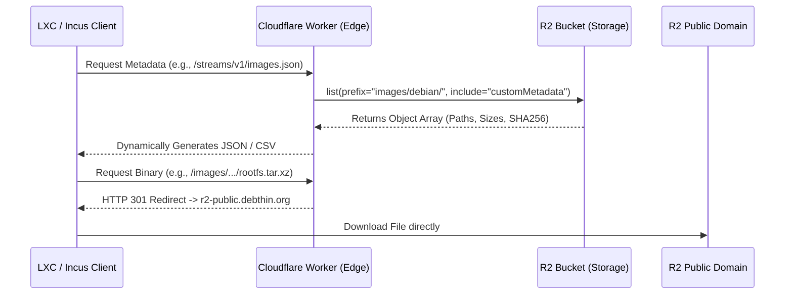

# Architecture: `debthin` Edge Image Server

## 1. System Overview

The `debthin` image distribution network utilizes a "Dumb Factory / Smart Edge" architecture. Rather than relying on a fragile Continuous Integration (CI) pipeline to maintain state and generate static indexes, the heavy lifting of state management is deferred entirely to a **Cloudflare Worker** at the edge.

The Worker acts as an intelligent API gateway sitting in front of a raw Cloudflare R2 object storage bucket. It dynamically maps the bucket's contents on the fly to serve the required metadata formats for different container hypervisors (Classic LXC and Incus/LXD).

## 2. Request Flow Diagram

## 3. Core Responsibilities

The Worker is designed to be stateless and fast, adhering to three primary responsibilities:

### A. Dynamic Protocol Translation
Different hypervisors expect different protocols. The Worker reads the raw directory structure of the R2 bucket (`/images/{os}/{release}/{arch}/{variant}/{version}/`) and translates it into:
* **Classic LXC:** A flat semicolon-separated CSV (`index-system`).
* **Incus / LXD:** A nested JSON metadata tree (`simplestreams`).

### B. Resolving the CI Race Condition
When GitHub Actions build multiple architectures simultaneously (e.g., `amd64` and `arm64`), they upload files concurrently. If the CI pipeline attempted to write the `images.json` index, they would overwrite each other. 
By generating the index dynamically at the edge via an S3 `list` operation, the Worker guarantees a perfectly accurate, real-time reflection of the bucket with zero risk of file corruption.

### C. Bandwidth Optimization (The 301 Pattern)
Cloudflare Workers have execution time limits and charge for CPU time. R2 public buckets offer free, unmetered egress. 
To optimize costs, the Worker **never** proxies the actual 32MB container binaries. If a client requests a binary file, the Worker instantly returns an `HTTP 301 Moved Permanently`, redirecting the client to download directly from the unmetered R2 public domain.

## 4. State & Hashing Strategy

Incus requires a `sha256` hash for every binary in its `images.json` manifest. Because a Worker cannot download and hash a 32MB file on the fly without timing out, the system uses **S3 Custom Metadata**.

1.  **The CI Phase:** The GitHub Action calculates the `sha256` hash of the tarball locally.
2.  **The Upload Phase:** The hash is attached to the R2 upload as a custom HTTP header (`--metadata "sha256=..."`).
3.  **The Edge Phase:** When the Worker queries the bucket, it requests the `customMetadata` payload. Cloudflare returns the pre-calculated hashes alongside the file paths instantly.

## 5. Routing Table

| Route | Client | Action | Cache Strategy |
| :--- | :--- | :--- | :--- |
| `/meta/1.0/index-system` | Classic LXC (`lxc-create`) | Generates flat CSV index mapping. | Edge RAM (1 Hour) |
| `/streams/v1/index.json` | Incus (`incus remote add`) | Serves static JSON pointer file. | Edge RAM (24 Hours) |
| `/streams/v1/images.json` | Incus (`incus launch`) | Generates Simplestreams JSON tree. | Edge RAM (1 Hour) |
| `/images/*` | All Clients | `HTTP 301` to public R2 endpoint. | Uncached (Instant redirect) |

## 6. Performance & Scaling

* **Cost:** Because the R2 bucket handles the heavy binary egress for free, and the Worker relies heavily on `Cache-Control` headers, millions of container downloads can be served under the Cloudflare Free Tier.
* **Maintenance:** The system requires zero database maintenance. Adding a new Debian release (e.g., `forky`) to the mirror automatically populates it in the LXC/Incus indexes the moment the CI pipeline uploads the first file to the R2 bucket.