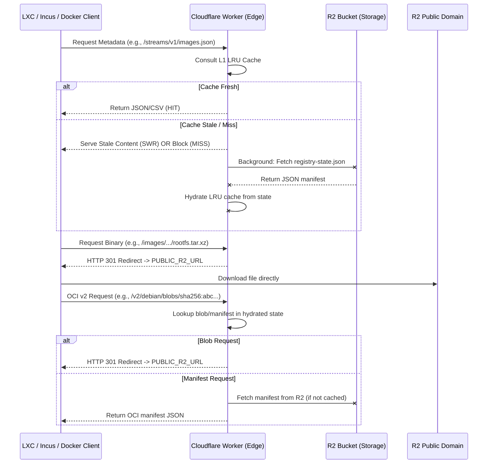

# Architecture: `debthin` Edge Image Server

## 1. System Overview

The `debthin` image distribution network uses a "Pre-compiled State / Smart Edge" architecture. A CI pipeline generates a `registry-state.json` manifest containing all index data (LXC CSV, Incus/LXD JSON, OCI blob/manifest dictionaries) and uploads it to R2. A **Cloudflare Worker** at the edge hydrates this state into RAM and serves it to clients.

The Worker also implements an OCI Distribution API (`v2/`) for container registry operations, mapping manifest and blob requests against the pre-compiled state.

## 2. Request Flow Diagram



## 3. Module Structure

```
workers/images/
├── index.js          # Entry point: request validation, routing, fetch handler
├── cache.js          # LRU cache instance (wraps core/cache.js)
├── http.js           # Frozen header sets, static payloads, response builder
├── indexes.js        # Registry state hydration from registry-state.json
└── handlers/
    └── index.js      # Route handlers: LXC, Incus, OCI, image redirects
```

### Data Flow

1. **`index.js`** validates the request and dispatches to a handler
2. **`indexes.js`** manages the `registry-state.json` lifecycle (fetch, parse, cache populate)
3. **`handlers/index.js`** serves cached indexes or performs OCI lookups
4. **`http.js`** builds conditional responses (304/200) with frozen header sets
5. **`cache.js`** provides the shared LRU cache instance

## 4. Core Responsibilities

### A. Pre-compiled State Hydration

The CI pipeline pre-computes all index data into `registry-state.json`:
- `lxc_csv`: Flat semicolon-separated CSV for classic LXC (`lxc-create -t download`)
- `incus_json`: Nested Simplestreams JSON tree for Incus/LXD
- `oci_blobs`: Dictionary mapping `sha256:...` digests to R2 keys
- `oci_manifests`: Dictionary mapping `repo:tag` to R2 manifest keys

The Worker fetches this once and caches the decoded payloads in-memory.

### B. Stale-While-Revalidate (SWR)

On every inbound request, the entry point calls `hydrateRegistryState()` via `ctx.waitUntil()`. If the cache is fresh, this is a no-op. If stale, it triggers a background refresh while serving the existing cached data.

### C. OCI Distribution API

The `/v2/` route implements a subset of the OCI Distribution Spec:
- `GET /v2/` — Version check (returns `{}` with `Docker-Distribution-Api-Version` header)
- `GET /v2/<repo>/blobs/<digest>` — 301 redirect to R2 public domain
- `GET /v2/<repo>/manifests/<ref>` — Serves OCI manifest JSON from R2 (cached in LRU)

### D. Metadata Caching

Files under `/images/` are classified by size using the `file_sizes` map from `registry-state.json`. Files at or below 100KB are served from the worker's LRU cache (fetched from R2 on miss). The `oci-layout` file is hardwired as a static 30-byte immutable response.

### E. Bandwidth Optimization (301 Pattern)

Large binary downloads (`rootfs.*`, `rootfs.squashfs`, `oci/blobs/*`) are never proxied. The Worker returns a `301 Moved Permanently` redirect to the unmetered R2 public domain (`env.PUBLIC_R2_URL`), keeping Worker CPU and bandwidth costs minimal.

## 5. Routing Table

| Route | Client | Action | Cache Strategy |
|:---|:---|:---|:---|
| `/meta/1.0/index-system` | Classic LXC (`lxc-create`) | Serve pre-compiled CSV index | L1 LRU + SWR |
| `/streams/v1/index.json` | Incus (`incus remote add`) | Serve static JSON pointer | Frozen in-memory |
| `/streams/v1/images.json` | Incus (`incus launch`) | Serve pre-compiled Simplestreams JSON | L1 LRU + SWR |
| `/v2/` | Docker / OCI clients | Return version handshake | Static |
| `/v2/<repo>/blobs/<digest>` | Docker / OCI clients | 301 redirect to R2 public | Immutable (1 year) |
| `/v2/<repo>/manifests/<ref>` | Docker / OCI clients | Serve OCI manifest from R2 | L1 LRU |
| `/images/*/oci/oci-layout` | OCI clients | Hardwired static response | Immutable (1 year) |
| `/images/*` (≤100KB) | All clients | Serve from R2 via LRU cache | L1 LRU (1 hour) |
| `/images/*` (>100KB) | All clients | 301 redirect to R2 public | Immutable (1 year) |
| `/health` | Monitoring | Return cache stats JSON | No-store |

## 6. Safety and Fault Tolerances

* **Deduplication:** Concurrent hydration requests are coalesced via the `indexCache.pending` map, preventing thundering herd on cold starts.
* **Missing State:** If `registry-state.json` is absent from R2, the hydration throws and individual handlers return 404.
* **Missing OCI Keys:** Unknown blob digests return `BLOB_UNKNOWN`; unknown manifest refs return `MANIFEST_UNKNOWN` (both with structured JSON error bodies).
* **Path Traversal:** Requests containing `..` are rejected with 400.
* **HEAD Optimization:** HEAD requests skip body generation (pass `null` buffer) while still exercising the full cache/conditional path.

## 7. Performance

* **Cost:** R2 public domain handles binary egress for free. The Worker only serves small JSON/CSV metadata and redirect responses.
* **Memory:** The LRU cache is bounded to 20MB / 256 slots with automatic eviction.
* **Cold Start:** `ctx.waitUntil()` background hydration pre-warms the cache on every request, minimising the impact of isolate restarts.